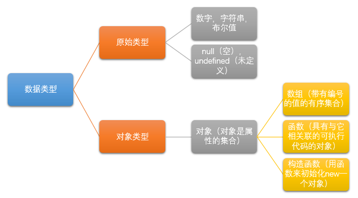

计算机程序的运行需要对值（value）进行操作，在编程语言中，能够表示并操作的值的类型乘坐数据类型（type），编程语言最基本的特性就是支持很多种数据类型。

JavaScript的数据类型分为两类：原始类型和对象类型，

JavaScript解释器有自己的内存管理机制，可以自动对内存进行垃圾回收，当不在有任何指引指向一个对象，解释器就会知道这个对象没用了，然后自动回收它所占用的内存资源。

只有null和undefined没有自己的方法，其他的数据类型都有自己的方法。
### 3.1 数字
JavaScript不区分整数型和浮点数值，所有数字均用浮点数值表示，能够表示整数的范围从-2~53-2~53,包含边界值，实际的操作是基于32位整数。
#### 3.1.1 整型直接量
用数字序列表示一个十进制整数。
