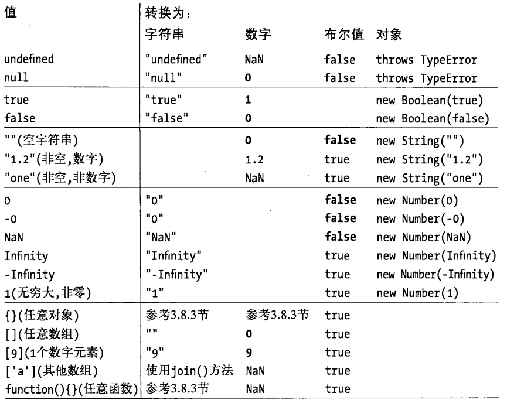

计算机程序的运行需要对值（value）进行操作，在编程语言中，能够表示并操作的值的类型乘坐数据类型（type），编程语言最基本的特性就是支持很多种数据类型。

`JavaScript`的数据类型分为两类：原始类型和对象类型，


`JavaScript`解释器有自己的内存管理机制，可以自动对内存进行垃圾回收，当不在有任何指引指向一个对象，解释器就会知道这个对象没用了，然后自动回收它所占用的内存资源。

只有`null`和`undefined`没有自己的方法，其他的数据类型都有自己的方法。
### 3.1 数字
`JavaScript`不区分整数型和浮点数值，所有数字均用浮点数值表示，能够表示整数的范围从-2~53-2~53,包含边界值，实际的操作是基于32位整数。
#### 3.1.1 整型直接量
用数字序列表示一个十进制整数。
#### 3.1.2 浮点型直接量
浮点型直接量可以含有小数点，实数由整数部分，小数点和小数部分组成。还可以使用指数计数法。
```
[digits][.digits](E|e)[(+|-)]digits
```
#### 3.1.3 JavaScript中的算术运算
JavaScript程序使用语言本身提供的算术运算符来进行数字运算的，包括加减乘除取余（+-*/%），除了基础运算符，还支持更加复杂的算数运算，通过Math对象属性定义的函数和常量来实现：
```
Math.round(0.6)//四舍五入
Math.floor(0.6)//向下取整
```
JavaScript算术运算在溢出，下溢或被零整除时不会报错。超出数字上限（溢出），结果为一个无穷大的值infinity，下溢（underflow）是运算结果无限接近零，但比能表示的最小值还小的时候，返回0或者-0。9/0并不会报错，只是简单返回无穷大Infinity。NaN并不等于NaN。
#### 3.1.4 二进制浮点数和四舍五入错误
二进制浮点数表示法并不能精确表示类似0.1这类简单的数字：
```
var x = .3-.2;
var y = .2-.1;
x == y    //=>false,两值不相等
x == .1   //=>false
y == .1   //=>true
```
#### 3.1.5 日期和时间
JavaScript语言核心包括Date()构造函数，用来创建表示日期和时间的对象。
### 3.2 文本
字符串string是由一组16位值组成的不可变的有序序列，字符串的索引从零开始，第一个字符的位置是0。
#### 3.2.1 字符串直接量
字符串直接量是由单引号或双引号括起来的字符序列。在ECMAScript3中，字符串必须写在一行中，在ECMAScript5中，可以拆分成数行，每行必须以反斜杠（\）结束。
#### 3.2.2 转义字符
反斜杠有着特别的意义，后加一个字符就不再表示它原来的含义。
#### 3.2.3 字符串的使用
如果把加号（+）运算符用于数字，表示两数相加，但如果用于字符串，则表示字符串相连。在ECMAScript5中，字符串可以当做只读数组。
### 3.3 布尔值
只有两个值，true或false。任意值都会转化成布尔值：undefined，null,0,-0,NaN,"",其他所有值都会转化成true，
### 3.4 null和undefined
- null是一个特殊值，常用来描述"空值"。对null执行typeof返回结果为“object”,也就是说null认为是一个特殊的对象值，含义是“非对象”。
- undefined表明变量没有初始化，如果查询对象属性或数组元素时返回undefined则说明这个属性或元素不存在。应该是有值的，只不过未定义。在ECMAScript3中，undefined是可读写的变量，可以给他赋任意值，在ECMAScript5中，undefined是只读的。typeof返回；类型是undefined，表明这个值是这个类型的唯一成员。
- 判断相等运算符（==)认为两者是相等的（要使用严格相等运算符“===”来区分它们）

### 3.5 全局对象
当JavaScript解释器启动时，它将创造一个新的全局对象，并给他一组定义的初始属性：
- 全局属性，比如undefined，Infinity和NaN
- 全局函数，比如isNaN(),parseInt(),eval()
- 构造函数，比如Date(),RegExp(),String(),Object(),Array()
- 全局对象，比如Math和JSON

### 3.6 包装对象
JavaScript对象是一种复合值：它是属性或已命名值的集合。通过“.”符号来引用属性值，当属性值是一个函数的时候，称其为方法。

字符串既然不是对象，为什么它会有属性呢？只要引用了字符串s的属性，JavaScript就会将字符串值通过调用new String()的方式转换成对象，这个对象继承了字符串的方法，滨北用来处理属性的引用。**一旦属性引用结束，这个新创建的对象就会销毁**
```
var s = 'test';  //创建一个字符串
s.len = 4;       //创建一个临时字符串对象，并给其len属性赋值为4，随即销毁这个对象
var t = s.len;   //通过原始字符串值创建一个新字符串对象，尝试读取其len属性，这个属性自然不存在
console.log(t);  //=>undefined
```
这段代码说明在读取字符串，数字和布尔值的属性值的时候，表现的像对象一样，但如果试图给其属性赋值，则会忽略这个操作，修改只发生在临时对象身上，而这个临时对象并未继续保留下来，这个临时对象称作**包装对象**

需要注意的是，通过String(),Number(),Boolean()构造函数来显式创建包装对象：
```
var a = new String('wqwq');
var b = 'wqwq';
a == b;     //=>true
a === b;    //=>false
typeof(a);   //=>"object"
typeof(b);   //=>"string"
a.i = 'ss';console.log(a.i); //=>"ss"
b.i = 'ss';console.log(b.i); //=>undefined
```
### 3.7 不可变的原始值与可变的对象引用
JavaScript原始值与对象有着根本区别，原始值是不可更改的。字符串中所有的方法看上去返回了一个修改后的字符串，实际上是返回的一个新的字符串值。

原始值的比较是值的比较：只有他们的值相等时他们才相等，如果比较两个单独的字符串，当且仅当他们的长度相等且每个索引的字符相等时，JavaScript才认为他们相等。

对象的比较并非值得比较，即使两个对象包含同样的属性及相同的值，他们也是不相等的，各个索引完全相等的两个数组也不相等（==）。

我们通常把对象成为引用类型，对象值都是引用，对象的比较都是引用的比较，当且仅当他们引用同一个基对象时，他们才相等。如果想得到一个对象或数组的副本，则必须显式复制对象的每个属性或数组的每个元素。
### 3.8 类型转换

#### 3.8.1 转换与相等性
由于JavaScript可以做灵活的类型转换，因此其“==”相等运算符也随着相等的含义灵活多变。一个值转换成另一个值并不意味着两个值相等。
#### 3.8.2 显式类型转换
最简单的做法就是使用Boolean(),Number(),String()函数，JavaScript的某些运算会做隐式转换
```
x+ ""//等价于String(x)
+x   //等价于Number(x),也可以写成x-0
!!x  // 等价于Boolean(x)
```
#### 对象转换为原始值
对象到布尔值，所有的对象都转换成true，包装对象亦是如此(new Boolean(false))==true

对象转换字符串
1. 如果对象具有toString()方法，调用，返回一个原始值（数组会转换称一个字符串，函数返回源码，日期返回可读的日期和时间字符串，RegExp类返回表达式直接量的字符串）
2. 如果没有toString()方法，或者这个方法并不返回原始值，调用valueOf()方法。
3. 否则抛出一个类型错误异常

对象转换成数字
1. 如果对象具有valueOf()这个方法，返回一个原始值，将这个原始值转换为数字，并返回这个数字。
2. 否则，如果对象具有toString()方法，后者返回一个原始值，则JavaScript将其转换并返回。
3. 否则，抛出一个类型错误异常。

### 3.9 变量声明
在JavaScript中，使用一个变量应该先声明，使用关键词var来声明，也可以一次声明多个变量，还可以将变量声明和初始赋值合在一起写。
**如果未在var声明中指定初始值，在它存入一个值之前，初始值就是undefined。**
如果试图读取一个没有声明的变量的值，JavaScript会报错，在ECMAScript5严格模式下，给一个没有声明的变量赋值也会报错。
### 3.10 变量作用域
一个变量的作用域（scope）是程序代码中定义这个变量的区域，全局变量拥有全局作用域，在函数内声明的变量只在函数体内有定义，他们是局部变量，作用域是局部的。函数参数也是局部变量，他们只在函数体内有意义。在函数体内，局部变量的优先级高于同名的全局变量。
#### 3.10.1 函数作用域和声明提前
JavaScript的函数作用域是指在声明的所有变量在函数体内始终是可见的，这意味着变量在声明之前就可以使用，这个特性被非正式的成为**变量提升**，即JavaScript函数里声明的所有变量（但不涉及赋值）都被提前至函数体的顶部。
#### 3.10.2 作为属性的变量
当声明一个JavaScript全局变量时，实际上是定义了一个全局对象的一个属性，当使用var声明一个变量时，创建的这个属性是不可配置的，也就是说这个变量无法通过delete运算符删除。在没有使用严格模式下，给一个未声明的变量赋值，JavaScript会自动创建一个全局变量，这种方式创建的变量是全局对象的正常的可配置属性，可以删除它们
```
var a = 1;
b = 2;
this.c = 3;
delete a;   //=>false
delete b;   //=>true
delete this.c;   //=>true
```
JavaScript全局变量是全局对象的属性，局部变量当做跟函数调用相关的某个对象的属性，ECMAScript3称为“调用对象”，ECMAScript5称为“声明上下文对象”。JavaScript可以允许使用this关键词来引用全局对象，却没有方法引用局部变量中存放的对象，这种存放局部变量的对象的特有性质，是一种我们不可见的内部实现。
#### 3.10.3 作用域链
